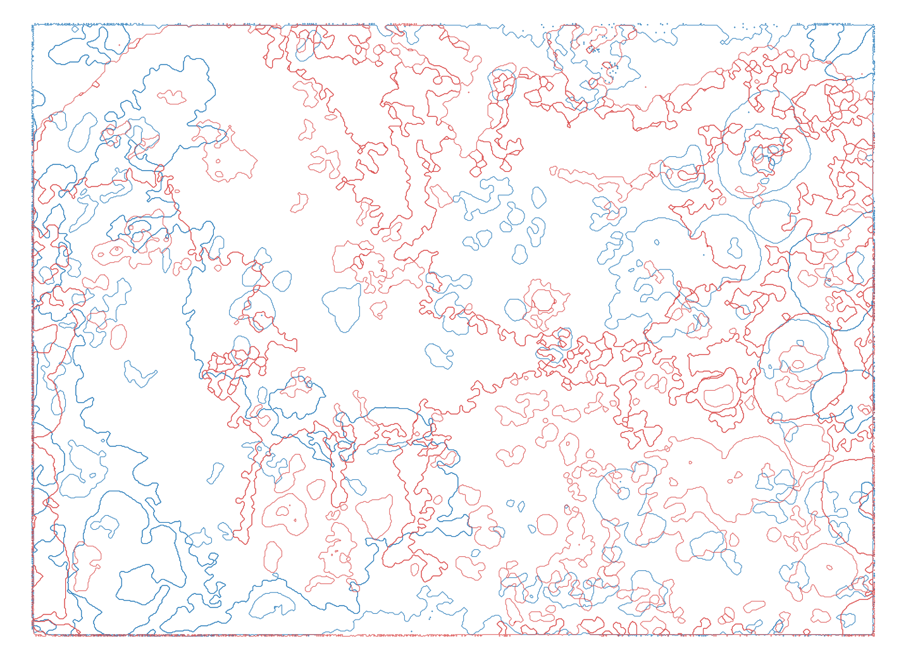
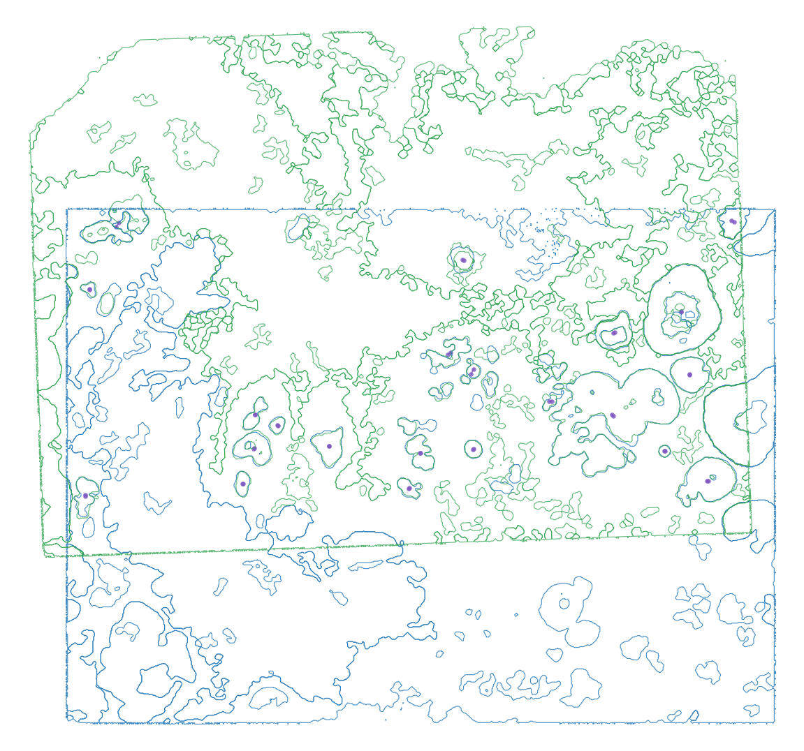

# Fully Automatic Partial-Anchor Breast Alignment

This page showcases a two-slice breast cancer contour alignment where the
overlapping tissue is only a local part of the two slices. It is a pairwise 3D
alignment QC example: HistoSeg estimates how the moving contour slice should be
placed relative to the fixed slice before downstream stack reconstruction, while
also making non-overlapping tissue explicit instead of forcing it to match.

The important point is that this run is fully automatic. HistoSeg did not use
manual landmarks, did not require the user to specify which structures should
match, and did not harmonize labels between slices. The method found the local
anchor constellation from the contour geometry itself.

## Result

The before/after panels below use clean documentation renders with no internal
legend or axis text. Blue is the fixed breast slice, red is the moving slice
before alignment, green is the moving slice after alignment, and purple marks
the automatically detected anchor links used by the accepted transform.

```{raw} html
<div style="display:grid; grid-template-columns:repeat(auto-fit,minmax(320px,1fr)); gap:18px; align-items:start; margin:1.2rem 0;">
  <figure style="margin:0;">
    
    <figcaption style="font-size:0.92rem; color:#536273; margin-top:0.45rem;">
      <strong>Before.</strong> The moving slice is still in its original local
      position. The large non-overlapping context is not treated as a failure.
    </figcaption>
  </figure>
  <figure style="margin:0;">
    
    <figcaption style="font-size:0.92rem; color:#536273; margin-top:0.45rem;">
      <strong>After.</strong> The local overlap is aligned by automatically
      discovered anchors; non-overlapping tissue remains passive geometry.
    </figcaption>
  </figure>
</div>
```

The accepted alignment is between `breastrep1S2.geojson` and
`breastrep2S3.geojson`. HistoSeg selected a cross-group local anchor match from
independently clustered contour labels:

| Metric | Value |
| --- | --- |
| Selected fixed group | `Structure 2` |
| Selected moving group | `Structure 3` |
| Anchor pairs selected | `26` |
| Anchor pairs used for transform | `22` |
| Median anchor residual | `51.74` coordinate units |
| P90 anchor residual | `148.83` coordinate units |
| Rotation | `1.94` degrees |
| Translation | `dx=-1410.1`, `dy=8958.6` |

## Interactive Review

Open the standalone overlay when you want to zoom, pan, and inspect the anchor
links:

```{raw} html
<p>
  <a href="_static/threed/breast/label_free_group_correspondence_20260507/group_overlap_alignment_overlay.html"
     target="_blank" rel="noopener">
    Open the standalone interactive overlay
  </a>
</p>
```

```{raw} html
<iframe
  src="_static/threed/breast/label_free_group_correspondence_20260507/group_overlap_alignment_overlay.html"
  title="Fully automatic partial-anchor breast contour alignment overlay"
  style="width:100%; height:760px; border:1px solid #d9dde3; border-radius:6px;"
  loading="lazy">
</iframe>
```

## Why This Is A Partial-Anchor Alignment

The two slices are not treated as if every contour in one file must have a
counterpart in the other file. HistoSeg first treats `assigned_structure` as a
within-slice grouping variable, evaluates all fixed-group and moving-group
constellations, and then estimates the transform from the best local RANSAC
inlier set.

Only the high-confidence `matched_anchor` pairs fit the transform. The
`matched_review` and `no_counterpart` contours are transformed as passive
geometry, so tissue outside the overlapping region can remain non-overlapping.
This is the behavior needed when two slices share a local 3D neighborhood but
also contain tissue that is absent, shifted, torn, or outside the counterpart
field of view.

## What Was Automated

- Landmark discovery was automatic: the transform used `22` accepted anchor
  pairs selected from `26` candidate inliers.
- Group selection was automatic: the best supported local correspondence was
  `Structure 2` in the fixed slice to `Structure 3` in the moving slice.
- Label handling was conservative: original contour labels were preserved, and
  no semantic harmonization was claimed.
- The full moving slice was transformed, but only anchor contours generated
  alignment force; non-counterpart regions were carried as passive geometry.

This makes the example useful as a 3D alignment QC demonstration for sparse or
partial serial-section overlap. It should not be read as standalone evidence
for dense 3D biology from two slices alone.

## Reproduce The Run

### From Raw Xenium Output Folders

For the manuscript workflow, HistoSeg can regenerate the contour inputs instead
of starting from pre-existing GeoJSON files. The end-to-end script starts from
two Xenium output folders, automatically discovers coarse `Structure N` groups,
generates multi-structure contour GeoJSON files, runs the same label-free
partial-anchor alignment, and writes a clean before/after figure plus a
provenance manifest.

```bash
python reproducibility/run_breast_partial_anchor_from_xenium.py \
  --out-dir reproducibility/results/breast_partial_anchor_from_xenium \
  --cluster-count auto \
  --min-structure-count 3 \
  --max-structure-count 8
```

The script defaults to the local breast Rep1/Rep2 Xenium folders used for this
example and resolves nested `_outs` folders automatically. Use
`--fixed-xenium-output` and `--moving-xenium-output` to point at another copy of
the data. The detailed method description, contour-generation formulae, API
mapping, and figure-legend draft are in
{doc}`manuscripts/breast_partial_anchor_alignment_methods`.

### From Existing GeoJSON Files

```bash
histoseg-3d align-contours-label-free \
  --fixed-geojson breastrep1S2.geojson \
  --moving-geojson breastrep2S3.geojson \
  --out-dir histoseg_label_free_breast_partial_anchor_20260507 \
  --partial-correspondence \
  --group-correspondence \
  --overwrite
```

The same label-free group-correspondence seed is also available in
`histoseg-3d reconstruct-stack`. With `--registration-backend auto`, HistoSeg
compares the standard semantic contour seed with the label-free group seed and
selects the label-free candidate only when the automatically discovered anchor
transform passes the configured count and residual thresholds. When the selected
hard seed is `label-free-group`, the stack soft-alignment stage uses
anchor-only residual TPS instead of semantic boundary attraction.

## Source Artifacts

- {download}`Alignment summary JSON <_static/threed/breast/label_free_group_correspondence_20260507/group_overlap_alignment_summary.json>`
- {download}`Automatically selected anchor table <_static/threed/breast/label_free_group_correspondence_20260507/group_ransac_anchors.csv>`
- {download}`Group correspondence matrix CSV <_static/threed/breast/label_free_group_correspondence_20260507/group_correspondence_matrix.csv>`

```{raw} html
<p>
  <a href="_static/threed/breast/label_free_group_correspondence_20260507/group_correspondence_matrix.html"
     target="_blank" rel="noopener">
    Open the group correspondence matrix HTML
  </a>
</p>
```
