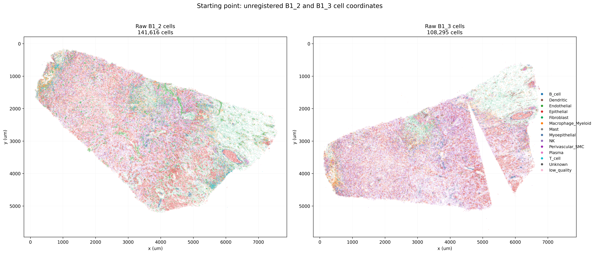
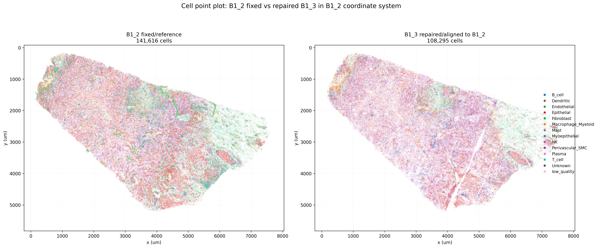
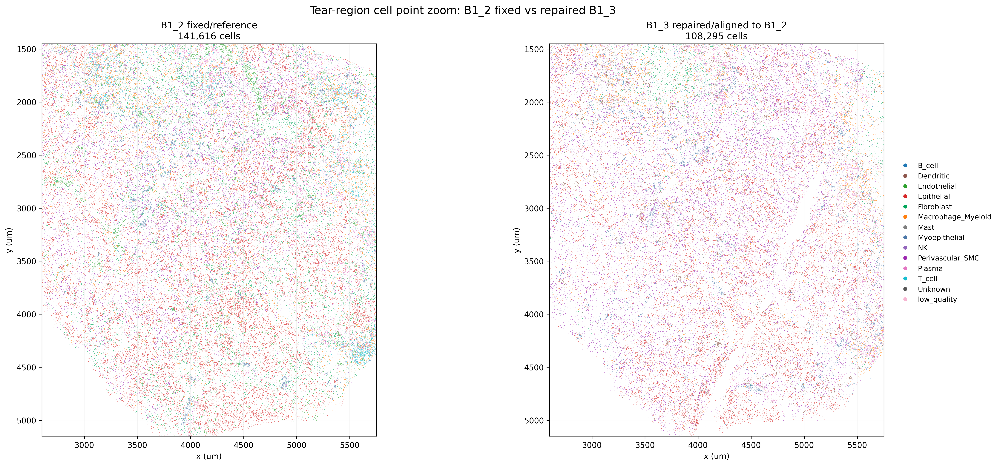
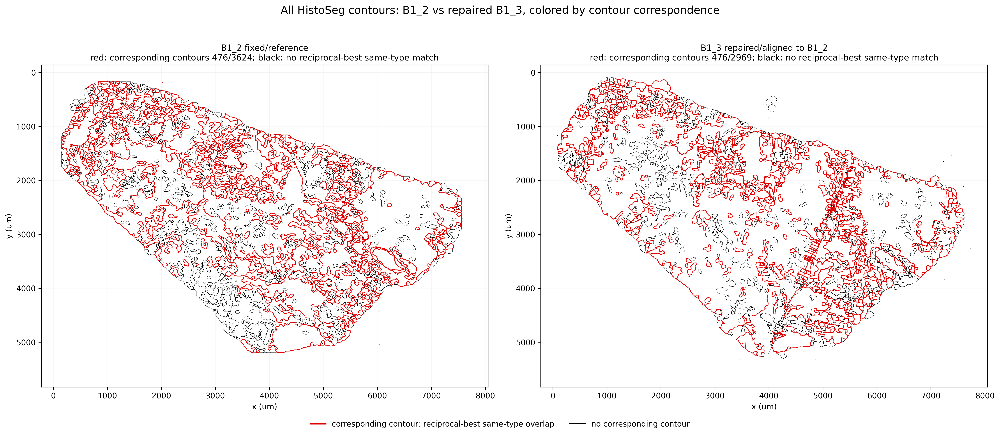
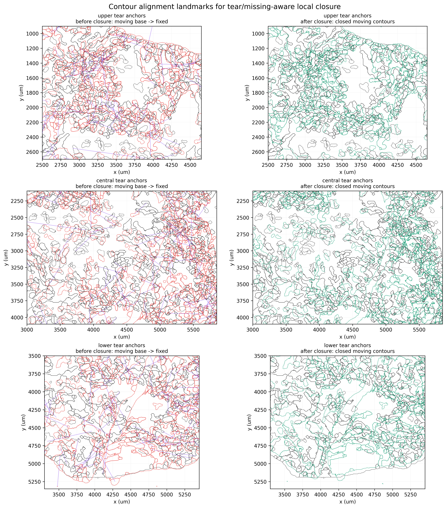

# Tear/Missing-Aware Breast Alignment

This page shows a two-section breast Xenium alignment where the moving section
contains a large tear-like gap. HistoSeg treats this as a **pairwise 2D
slice-alignment step inside the 3D/serial-section workflow**: the deformation is
estimated in the two-dimensional tissue coordinate frame, but the purpose is to
prepare neighboring sections for stack reconstruction and QC.

The example aligns `B1_3` into the `B1_2` coordinate system. Unlike semantic TPS
boundary attraction, the tear-closure stage does not assume that every gap
should be filled by deformation. It separates two cases:

- **tear-like displacement**: moving tissue fragments are present on both sides
  and can be locally translated toward matched fixed contours;
- **missing tissue**: no moving counterpart is detected, so the region is
  reported as missing/passive rather than synthesized.

## Result

The starting point is deliberately rough: the two raw cell-coordinate clouds are
not in the same coordinate frame, and `B1_3` already contains an obvious
sectioning gap.

```{raw} html
<figure style="margin:1.2rem 0;">
  
  <figcaption style="font-size:0.92rem; color:#536273; margin-top:0.45rem;">
    <strong>Raw cell coordinates.</strong> B1_2 is the fixed section
    (141,616 cells). B1_3 is the moving section (108,295 cells) before
    pairwise alignment and tear-aware closure.
  </figcaption>
</figure>
```

After contour generation, hard alignment, and tear/missing-aware local closure,
the moving `B1_3` cell coordinates are expressed in the `B1_2` coordinate
system. The large displaced tissue fragment is carried as real tissue; missing
regions remain visible instead of being hallucinated.

```{raw} html
<figure style="margin:1.2rem 0;">
  
  <figcaption style="font-size:0.92rem; color:#536273; margin-top:0.45rem;">
    <strong>Final cell-coordinate review.</strong> The repaired B1_3 cell cloud
    is shown in the B1_2 coordinate system after contour-guided local closure.
  </figcaption>
</figure>
```

The local tear region is easier to inspect in a zoomed panel:

```{raw} html
<figure style="margin:1.2rem 0;">
  
  <figcaption style="font-size:0.92rem; color:#536273; margin-top:0.45rem;">
    <strong>Tear-region cell zoom.</strong> The gap remains visible as a tissue
    artifact, while nearby observed tissue is brought into the fixed-section
    coordinate frame.
  </figcaption>
</figure>
```

## Contour Correspondence

The key alignment evidence is contour based. HistoSeg generated `3,624`
cell-type contours for fixed `B1_2` and `2,969` contours for repaired `B1_3`.
In the frozen final review, red contours are reciprocal-best same-celltype
correspondences and black contours have no one-to-one correspondence under that
definition.

```{raw} html
<figure style="margin:1.2rem 0;">
  
  <figcaption style="font-size:0.92rem; color:#536273; margin-top:0.45rem;">
    <strong>Contour correspondence audit.</strong> Red contours participate in
    reciprocal same-celltype correspondence; black contours do not.
  </figcaption>
</figure>
```

The tear/missing-aware closure step uses contour landmarks as local translation
evidence. Purple lines connect the moving contour centroids before closure to
their fixed-section counterparts. The closed moving contours are drawn in green.

```{raw} html
<figure style="margin:1.2rem 0;">
  
  <figcaption style="font-size:0.92rem; color:#536273; margin-top:0.45rem;">
    <strong>Local contour landmarks.</strong> Black is fixed B1_2, red is the
    moving B1_3 base alignment, green is the locally closed B1_3 result, and
    purple lines show contour-centroid landmark displacements.
  </figcaption>
</figure>
```

For the package demo run on the B1_2/B1_3 pair, HistoSeg reported:

| Metric | Value |
| --- | ---: |
| Fixed B1_2 contours | 3,624 |
| Moving B1_3 contours | 2,969 |
| Reciprocal contour correspondences | 1,074 |
| Local translation anchors used | 868 |
| Fixed unmatched contours reported as possible missing tissue | 2,550 |
| Moving unmatched passive contours | 1,895 |
| Moving cells written | 108,295 |
| Median moving-cell displacement | 43.94 µm |
| P90 moving-cell displacement | 73.07 µm |

## Workflow From Raw Cells

The full workflow starts before alignment:

1. Start from the raw Xenium cell tables for `B1_2` and `B1_3`.
2. Use Cell-GPS / StructureMap relationships to define coarse spatial
   structures or cell-type partitions. In HistoSeg this is exposed through the
   contour workflows that call the `cellgps` package.
3. Generate HistoSeg multi-structure or cell-type contours for each section.
4. Hard-align `B1_3` into the `B1_2` coordinate system with the existing
   pairwise contour alignment machinery.
5. Run tear/missing-aware local closure on the hard-aligned moving contours and
   the corresponding moving cell table.
6. Review contour correspondences, local landmark links, cell-point overlays,
   and missing/passive contour counts before using the pair in downstream stack
   reconstruction.

The important design choice is that local closure is **not** a global TPS pull.
It estimates a capped local translation field from contour correspondences. The
moving cells and moving contours are warped together, and unmatched tissue is
carried as passive geometry.

## Python API

```python
from histoseg.threed import ContourTearClosureConfig, run_contour_tear_closure

cfg = ContourTearClosureConfig(
    fixed_geojson="B1_2_celltype_contours_um.geojson",
    moving_aligned_geojson="B1_3_tvl1_base_celltype_contours.geojson",
    moving_cells_csv="B1_3_tvl1_base_cells.csv",
    fixed_cells_csv="B1_2_cells.csv",
    out_dir="outputs/B1_2_B1_3_tear_closure",
    group_property="assigned_structure",
    moving_x_column="x_tvl1_base_um",
    moving_y_column="y_tvl1_base_um",
    min_motion_um=50.0,
    influence_radius_um=650.0,
    max_displacement_um=160.0,
)

result = run_contour_tear_closure(cfg)
print(result.closed_cells_csv)
print(result.closed_contours_geojson)
print(result.landmarks_csv)
```

## Command Line

```bash
histoseg-3d close-contour-tear \
  --fixed-geojson B1_2_celltype_contours_um.geojson \
  --moving-aligned-geojson B1_3_tvl1_base_celltype_contours.geojson \
  --moving-cells-csv B1_3_tvl1_base_cells.csv \
  --moving-x-column x_tvl1_base_um \
  --moving-y-column y_tvl1_base_um \
  --fixed-cells-csv B1_2_cells.csv \
  --out-dir outputs/B1_2_B1_3_tear_closure \
  --group-property assigned_structure \
  --min-motion-um 50 \
  --influence-radius-um 650 \
  --max-displacement-um 160 \
  --overwrite
```

The command writes:

| Output | Meaning |
| --- | --- |
| `moving_contour_tear_closed_cells.csv` | moving cell table with closed `x/y_contour_tear_closure_um` coordinates and displacement columns |
| `moving_contour_tear_closed_contours.geojson` | moving contour GeoJSON after local contour-guided closure |
| `contour_tear_closure_correspondences.csv` | all reciprocal same-group contour correspondences |
| `contour_tear_closure_landmarks.csv` | contour-centroid landmarks used for local translation |
| `contour_tear_closure_summary.json` | contour counts, missing/passive counts, displacement summaries, and provenance |
| `contour_tear_closure_landmarks.png` | before/after contour and landmark-link QC panel |

## Why This Lives In `histoseg.threed`

The transform itself is two-dimensional. It operates on `x/y` contour and cell
coordinates from a pair of sections. It lives in `histoseg.threed` because it is
the same family as HistoSeg's existing breast partial-anchor alignment example:
pairwise 2D section alignment used to build or QC serial-section 3D
reconstruction. It is not a volumetric 3D deformation, and it should not be
used as evidence for dense 3D biology without appropriate sectioning density
and validation.

## Source Artifacts

- {download}`Package demo summary JSON <_static/threed/breast/tear_aware_B1_2_B1_3_20260611/contour_tear_closure_summary.json>`
- {download}`Package demo landmark table <_static/threed/breast/tear_aware_B1_2_B1_3_20260611/contour_tear_closure_landmarks.csv>`
