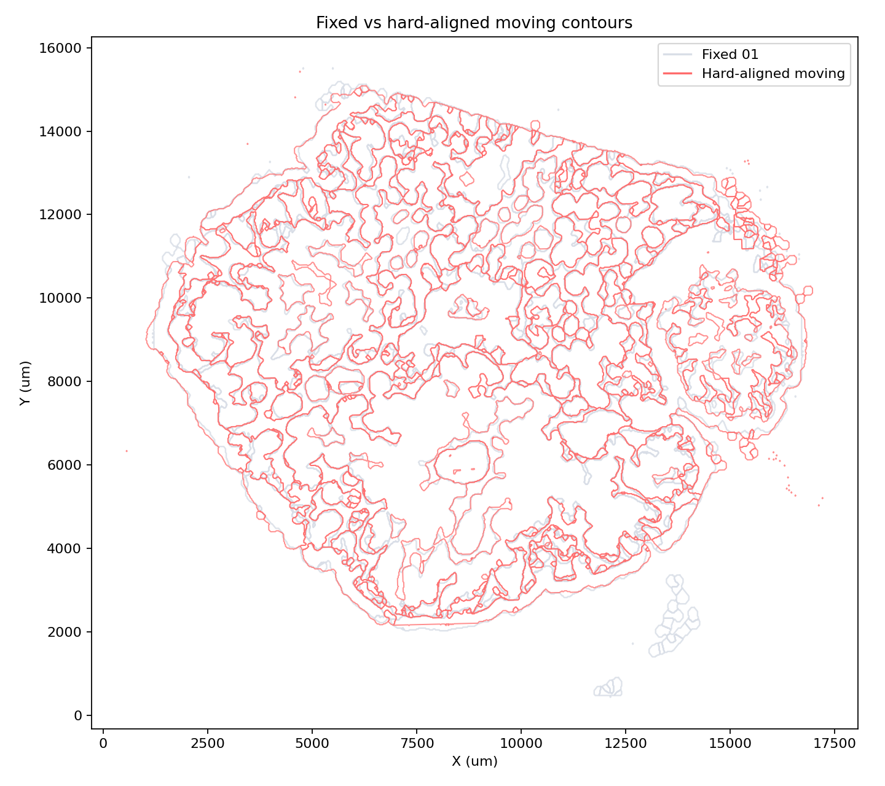
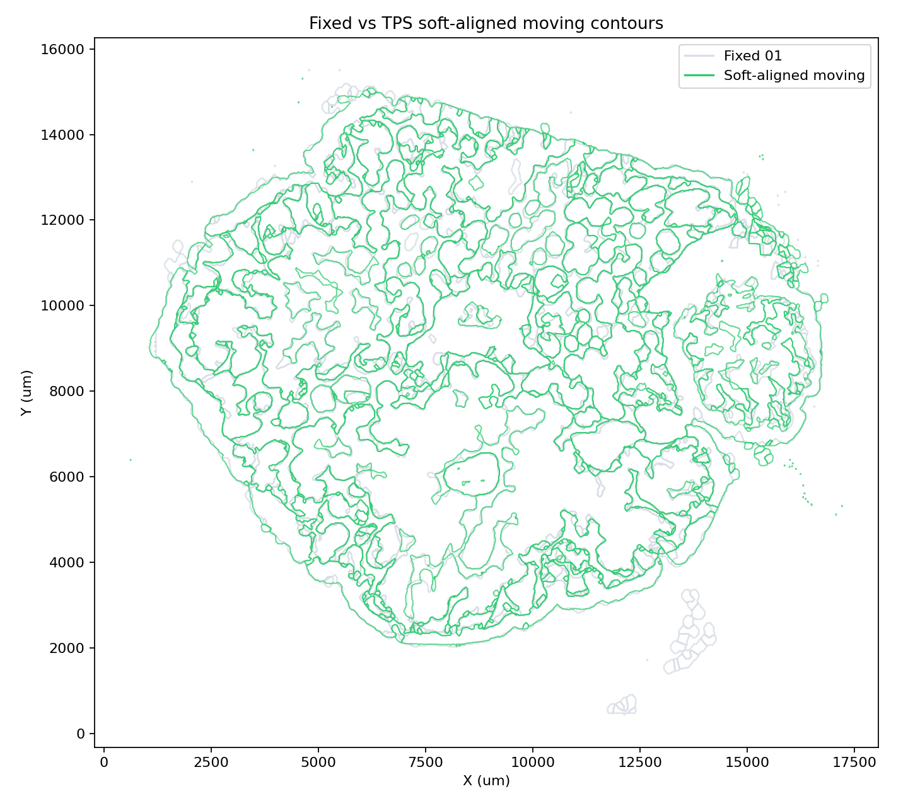
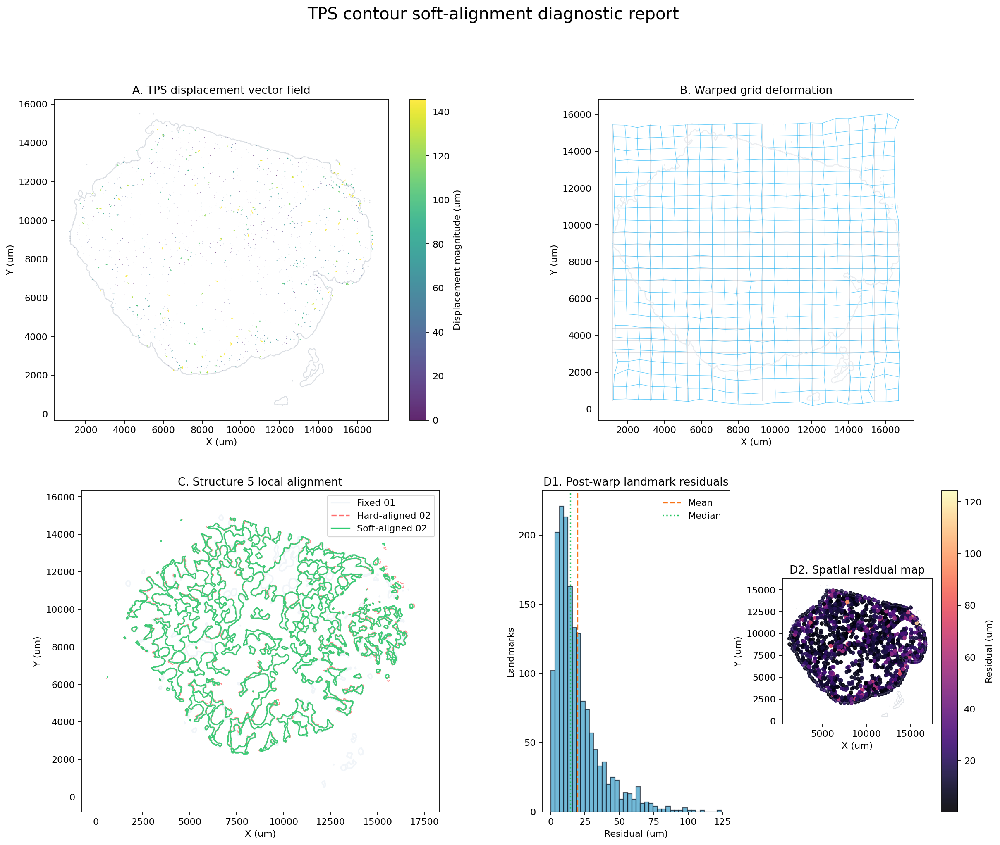

# 3D Contour Soft Alignment Tutorial

This tutorial reproduces the first `histoseg.threed` workflow: TPS soft
alignment of a hard-aligned Xenium contour slice. The bundled polyp example
contains two contour GeoJSON files from the same sample:

- `polyp_fixed_01.geojson`: the reference slice.
- `polyp_moving_02_hard_aligned_to_01.geojson`: slice 02 after global
  similarity alignment to slice 01.

Download the bundled inputs directly from the rendered docs:
{download}`fixed slice 01 <data/3d_soft_alignment/polyp_fixed_01.geojson>` and
{download}`hard-aligned moving slice 02 <data/3d_soft_alignment/polyp_moving_02_hard_aligned_to_01.geojson>`.

The soft-alignment step does not recompute hard alignment. It uses same-label
contour boundaries to build a conservative thin-plate-spline displacement field
and then warps the moving GeoJSON vertices.

## Run From The Command Line

From the repository root:

```bash
histoseg-3d reconstruct \
  --fixed-geojson docs/tutorials/data/3d_soft_alignment/polyp_fixed_01.geojson \
  --moving-hard-aligned-geojson docs/tutorials/data/3d_soft_alignment/polyp_moving_02_hard_aligned_to_01.geojson \
  --out-dir outputs/3d_soft_alignment_polyp \
  --group-property assigned_structure \
  --diagnostic-structure "Structure 5"
```

The bundled Xenium annotation files store the contour type in
`properties.assigned_structure`. For simpler GeoJSON exports, use
`--group-property structure`.

## Run From Python

```python
from histoseg.threed import (
    ThreeDContourReconstructionConfig,
    run_3d_contour_reconstruction,
)

cfg = ThreeDContourReconstructionConfig(
    fixed_geojson="docs/tutorials/data/3d_soft_alignment/polyp_fixed_01.geojson",
    moving_hard_aligned_geojson=(
        "docs/tutorials/data/3d_soft_alignment/"
        "polyp_moving_02_hard_aligned_to_01.geojson"
    ),
    out_dir="outputs/3d_soft_alignment_polyp",
    group_property="assigned_structure",
    diagnostic_structure="Structure 5",
)

result = run_3d_contour_reconstruction(cfg)
print(result.soft_aligned_geojson)
print(result.diagnostic_report_png)
```

## Outputs

The workflow writes a soft-aligned GeoJSON plus QC tables and figures:

- `soft_aligned_contours.geojson`
- `soft_tps_alignment_metrics.csv`
- `soft_tps_landmarks.csv`
- `soft_tps_diagnostic_residuals.csv`
- `soft_tps_alignment_summary.json`
- `soft_tps_overlay_hard_before.png`
- `soft_tps_overlay_soft_after.png`
- `soft_tps_landmarks_qc.png`
- `soft_tps_diagnostic_report.png`

For this polyp example, the package default uses 1660 boundary landmarks plus
8 zero-displacement anchors. All 666 moving polygons remain valid after the
soft warp.

| QC metric | Hard-aligned 02 | Soft TPS 02 |
| --- | ---: | ---: |
| Union IoU vs fixed 01 | 0.9654 | 0.9722 |
| Structure 1 IoU | 0.8745 | 0.9060 |
| Structure 2 IoU | 0.6402 | 0.6852 |
| Structure 3 IoU | 0.6663 | 0.6910 |
| Structure 4 IoU | 0.8407 | 0.8561 |
| Structure 5 IoU | 0.5862 | 0.6199 |

The landmark residual distribution after TPS has median `14.36 um`, mean
`19.42 um`, and p95 `54.93 um`.

## Overlay QC

The hard-aligned moving slice is already close to the fixed slice, but local
boundary mismatch remains:



After TPS, the moving slice receives a conservative local correction while
preserving the annotation properties and feature count:



## TPS Diagnostic Report

The diagnostic report combines the displacement vector field, warped grid,
Structure 5 focus view, and landmark residual distribution. It is intended to
separate true local 3D morphology differences from registration failure.



Structure 5 improves, but it remains lower than the global union IoU. That is
expected for a local structure that changes shape between neighboring physical
sections; the TPS field corrects systematic displacement without forcing an
over-warped match.
