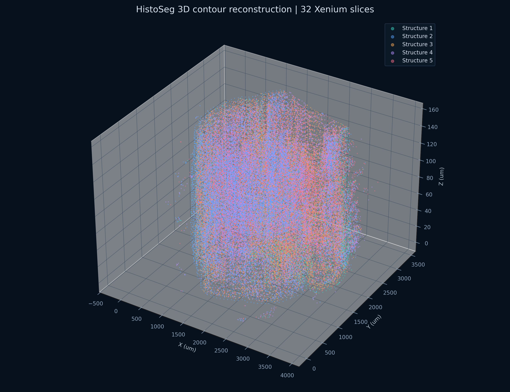

# 3D Contour Stack Reconstruction Tutorial

This tutorial shows the same-sample multi-slice workflow in `histoseg.threed`.
It is designed for a folder of ordered Xenium slice outputs and uses GitHub
`pyXenium` for IO:

```python
from pyXenium.io import read_xenium

slide = read_xenium(xenium_output_dir, as_="slide")
```

HistoSeg uses the `XeniumSlide.table.obs` cell coordinates, combines them with
a unified cluster source, generates one 2D contour GeoJSON per slice, aligns the
contours in fixed slice order, and exports a 3D contour stack.

## Inputs

The polyp run used 32 Xenium slice folders from one sample. The folder names
were discovered in numeric order:

`A079-C-008_1` through `A079-C-008_16`, then `A079-C-008_25` through
`A079-C-008_40`.

The structure definition came from a segmentation strategy file with one line
per structure:

```text
18
31,3,30
1,6,8
24,0,2,16,11,13
27,22,29,26,28,25,12,21,23,7,17,19,5,14,15,4,9,10,20
```

Those cluster IDs came from the merged Leiden AnnData, so the run used
`--merged-h5ad` and `--merged-cluster-column leiden_1_0`. Per-slice Xenium
graphclust labels are not interchangeable with this segmentation strategy.

## Command

```bash
histoseg-3d reconstruct-stack \
  --xenium-root "Y:/long/spatialpathologist/3D aligment/polyp" \
  --segmentation-strategy "Y:/long/spatialpathologist/3D aligment/polyp/contour for alignment/segmentationstrategy.txt" \
  --merged-h5ad "Y:/long/spatialpathologist/3D aligment/polyp/pdc_merge_leiden/polyp_32samples_min3_count5_leiden_20260501_processed_leiden.h5ad" \
  --merged-cluster-column leiden_1_0 \
  --out-dir "Y:/long/spatialpathologist/3D aligment/polyp/histoseg_3d_reconstruction" \
  --z-spacing-um 5 \
  --hard-alignment-maxiter 40 \
  --voxel-size-um 80 \
  --point-sample-distance-um 80 \
  --no-alignment-preview \
  --overwrite
```

On Windows, installing GitHub `pyXenium` can require long path support:

```powershell
$env:GIT_CONFIG_COUNT='1'
$env:GIT_CONFIG_KEY_0='core.longpaths'
$env:GIT_CONFIG_VALUE_0='true'
python -m pip install "pyXenium @ git+https://github.com/hutaobo/pyXenium.git"
```

## Outputs

The stack workflow writes:

- `xenium_slice_manifest.csv`
- `slice_contours/*/xenium_explorer_annotations.geojson`
- `aligned_contours/*_aligned.geojson`
- `pairwise_alignment_metrics.csv`
- `aligned_slice_manifest.csv`
- `aligned_contour_3d_points.csv`
- `histoseg_3d_contour_stack.html`
- `meshes/Structure_1.ply` through `meshes/Structure_5.ply`
- `meshes/mesh_manifest.csv`
- `3d_stack_reconstruction_summary.json`

## QC Summary

For the 32-slice polyp run:

| Metric | Value |
| --- | ---: |
| Aligned slices | 32 |
| Pairwise alignments | 31 |
| Hard alignments accepted | 31 / 31 |
| Soft TPS alignments accepted | 31 / 31 |
| Mean raw pairwise union IoU | 0.7220 |
| Mean hard-aligned union IoU | 0.9386 |
| Mean soft-aligned union IoU | 0.9480 |
| Minimum soft-aligned union IoU | 0.9136 |
| 3D sampled contour points | 94,108 |
| Reconstructed structure meshes | 5 |

The hard alignment corrects large global offsets and rotations. The TPS step is
guarded by a no-degrade rule: if a local warp lowers the union IoU, HistoSeg
keeps the hard-aligned result for that pair and records the rejected attempt.

## Preview

The interactive Plotly file is the main visualization artifact:

```text
histoseg_3d_contour_stack.html
```

The same run also produced this static preview for documentation:



The PLY files in `meshes/` are per-structure contour-stack surfaces. They are
useful for external 3D viewers or downstream mesh processing.
