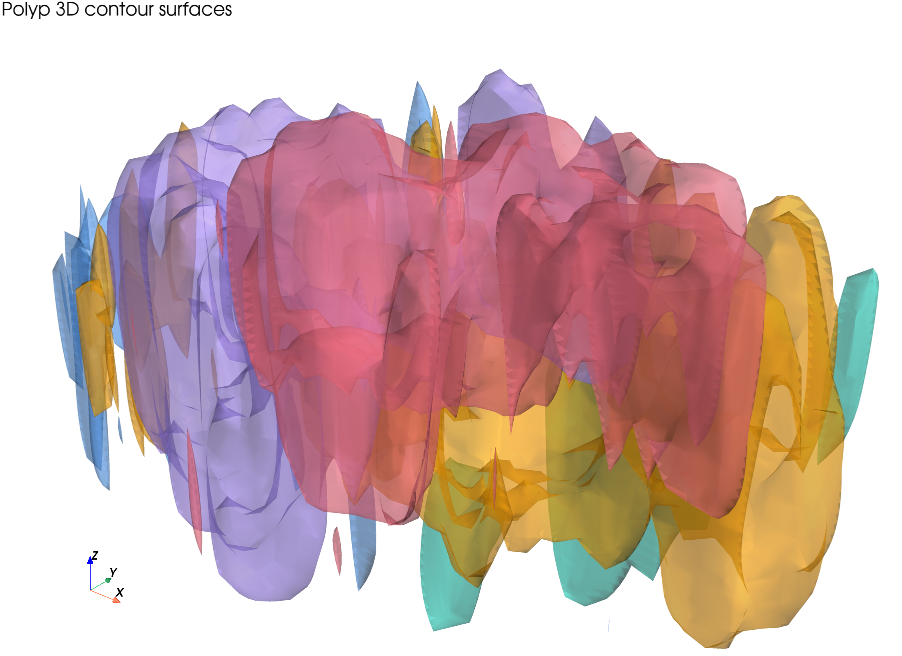
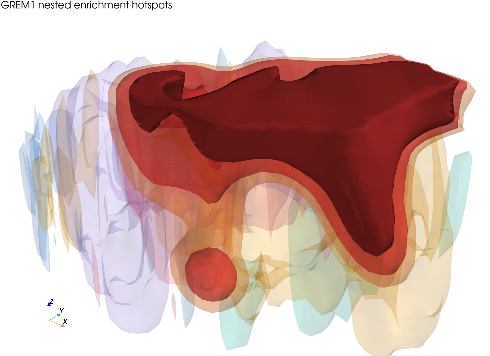
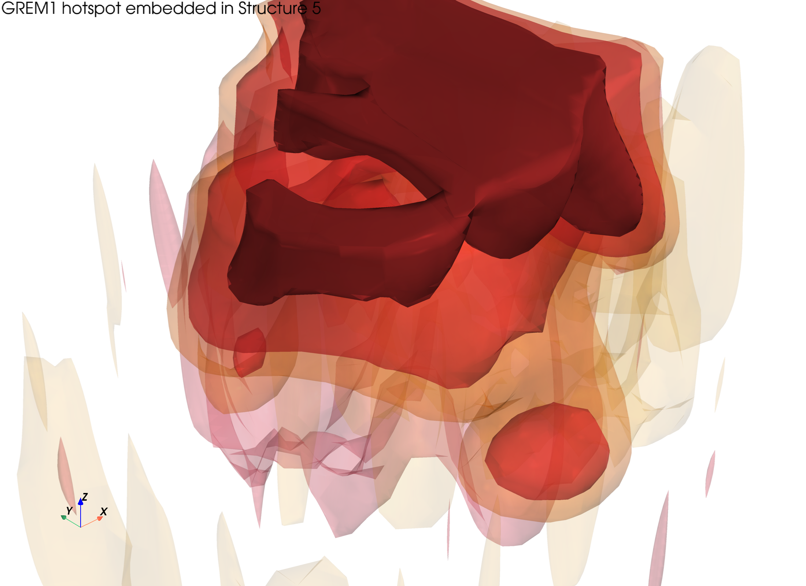
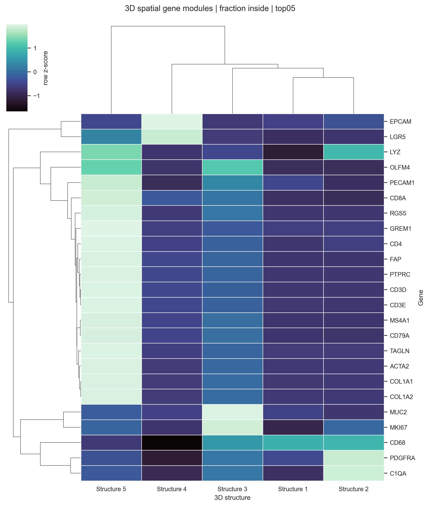
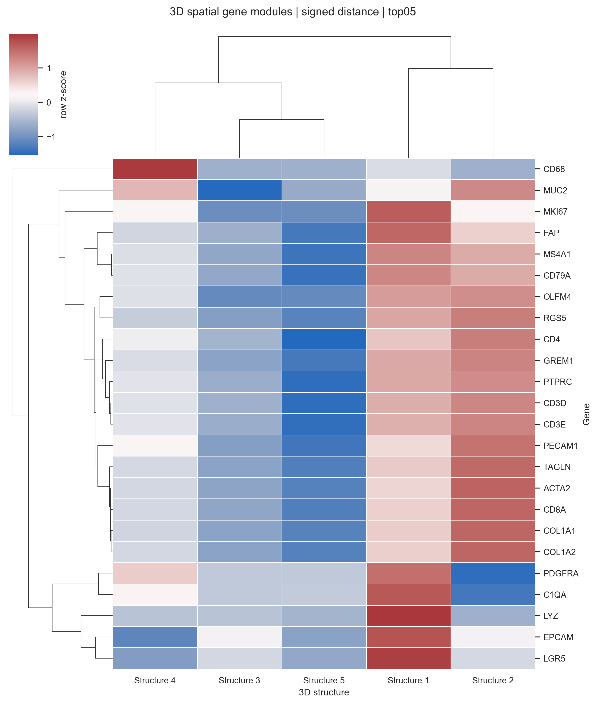

# Polyp 24-Gene 3D Spatial Modules Tutorial

This tutorial shows how HistoSeg turns a 32-slice Xenium contour reconstruction
into a gene-by-structure 3D spatial module analysis. The example uses a 24-gene
starter panel from a polyp sample and demonstrates the full downstream workflow:

1. map genes into normalized 3D enrichment voxel fields,
2. extract nested enrichment hotspot surfaces,
3. quantify overlap and signed distances to reconstructed structures,
4. cluster genes by 3D physical localization.

The figures below are static tutorial assets. They were rendered locally with
`scripts/render_polyp_24gene_figures.py`; ReadTheDocs only displays the PNG
files and does not run VTK/PyVista during documentation builds.

## Inputs

This tutorial starts after `histoseg-3d reconstruct-stack` has produced a
registered 32-slice contour stack:

- `aligned_slice_manifest.csv`
- `aligned_leiden_3d_cells.parquet`
- `meshes/Structure_1.ply` through `meshes/Structure_5.ply`
- a merged AnnData `.h5ad` containing expression for all aligned cells

The starter panel covers stromal, epithelial, proliferative, immune, vascular,
and perivascular signals:

```text
GREM1 COL1A1 COL1A2 ACTA2 PDGFRA TAGLN FAP
EPCAM MUC2 OLFM4 LGR5 MKI67
PTPRC CD3D CD3E CD8A CD4 MS4A1 CD79A LYZ CD68 C1QA
PECAM1 RGS5
```

## Run Spatial Module Discovery

```bash
histoseg-3d discover-spatial-modules \
  --h5ad "Y:/long/spatialpathologist/3D aligment/polyp/pdc_merge_leiden/polyp_32samples_min3_count5_leiden_20260501_processed_leiden.h5ad" \
  --aligned-cells-parquet "Y:/long/spatialpathologist/3D aligment/polyp/histoseg_3d_reconstruction/aligned_leiden_3d_cells.parquet" \
  --stack-root "Y:/long/spatialpathologist/3D aligment/polyp/histoseg_3d_reconstruction" \
  --out-dir "Y:/long/spatialpathologist/3D aligment/polyp/histoseg_3d_reconstruction/gene_overlays/batch_3d_genes_starter_panel" \
  --genes GREM1 COL1A1 COL1A2 ACTA2 PDGFRA TAGLN FAP EPCAM MUC2 OLFM4 LGR5 MKI67 PTPRC CD3D CD3E CD8A CD4 MS4A1 CD79A LYZ CD68 C1QA PECAM1 RGS5 \
  --mesh-export-formats ply
```

The command writes one `<GENE>_density/` folder per gene and records failures in
`batch_gene_status.csv`. Missing or low-expression genes are skipped without
stopping the batch.

For this starter panel all 24 genes completed successfully.

## Anatomy And GREM1 Hotspots

The structure surfaces are reconstructed by voxelizing aligned 2D contour
polygons, smoothing the 3D volume, and extracting a Marching Cubes surface.



For each gene, HistoSeg computes normalized enrichment:

```text
smoothed gene expression sum / smoothed total cell count
```

This avoids confusing high cellularity with true gene enrichment. Nested
hotspot surfaces are extracted at the top 15%, 10%, and 5% of the smoothed
enrichment field.



The GREM1 top 5% core is visually embedded inside Structure 5.



## Quantify Structure Localization

HistoSeg uses cached structure masks and voxel operations for robust 3D
quantification. For each gene hotspot and structure, it reports:

- hotspot volume inside each structure,
- fraction of hotspot inside each structure,
- fraction of each structure covered by the hotspot,
- unsigned proximity distance,
- signed localization distance.

The signed distance field is defined as:

```text
outside = distance_transform_edt(~structure_mask, sampling=(z, y, x))
inside = distance_transform_edt(structure_mask, sampling=(z, y, x))
signed_distance = outside outside the structure, -inside inside the structure
```

Negative values therefore mean that a gene hotspot is embedded inside a
structure. Positive values mean the hotspot is outside and separated from that
structure boundary.

## Spatial Gene Modules

The matrix below clusters genes by the fraction of their top 5% hotspot volume
inside each 3D structure.



In this run:

- `GREM1`, `FAP`, `TAGLN`, `ACTA2`, and `COL1A1/COL1A2` localize strongly to
  Structure 5, matching a stromal/fibrotic compartment.
- `MUC2`, `OLFM4`, and `MKI67` are enriched around Structure 3, matching a
  differentiated/proliferative epithelial compartment.
- `LGR5` and `EPCAM` are prominent around Structure 4, consistent with an
  epithelial/stem-like niche.
- `C1QA` and `PDGFRA` show a Structure 2 signal, suggesting a macrophage or
  perivascular-associated compartment.

The signed-distance matrix gives a complementary view. Negative row-normalized
values indicate structures where the hotspot is physically embedded rather than
merely nearby.



## Advanced Commands

After a batch run, rerun only the overlap/SDF step for one gene:

```bash
histoseg-3d quantify-gene-structure \
  --stack-root "Y:/long/spatialpathologist/3D aligment/polyp/histoseg_3d_reconstruction" \
  --gene-density-dir "Y:/long/spatialpathologist/3D aligment/polyp/histoseg_3d_reconstruction/gene_overlays/batch_3d_genes_starter_panel/GREM1_density" \
  --gene GREM1
```

Regenerate a clustermap from existing matrices:

```bash
histoseg-3d plot-spatial-modules \
  --batch-dir "Y:/long/spatialpathologist/3D aligment/polyp/histoseg_3d_reconstruction/gene_overlays/batch_3d_genes_starter_panel" \
  --matrix fraction_inside \
  --hotspot top05
```

Render the static hero figures locally with PyVista:

```bash
python scripts/render_polyp_24gene_figures.py \
  --stack-root "Y:/long/spatialpathologist/3D aligment/polyp/histoseg_3d_reconstruction" \
  --gene GREM1 \
  --batch-dir "Y:/long/spatialpathologist/3D aligment/polyp/histoseg_3d_reconstruction/gene_overlays/batch_3d_genes_starter_panel" \
  --out-dir docs/_static/threed/polyp/24gene \
  --figures all \
  --camera-preset oblique \
  --z-scale 8
```

`pyvista` is intentionally not a core HistoSeg dependency. The renderer is a
documentation asset script for reproducible static figures.
